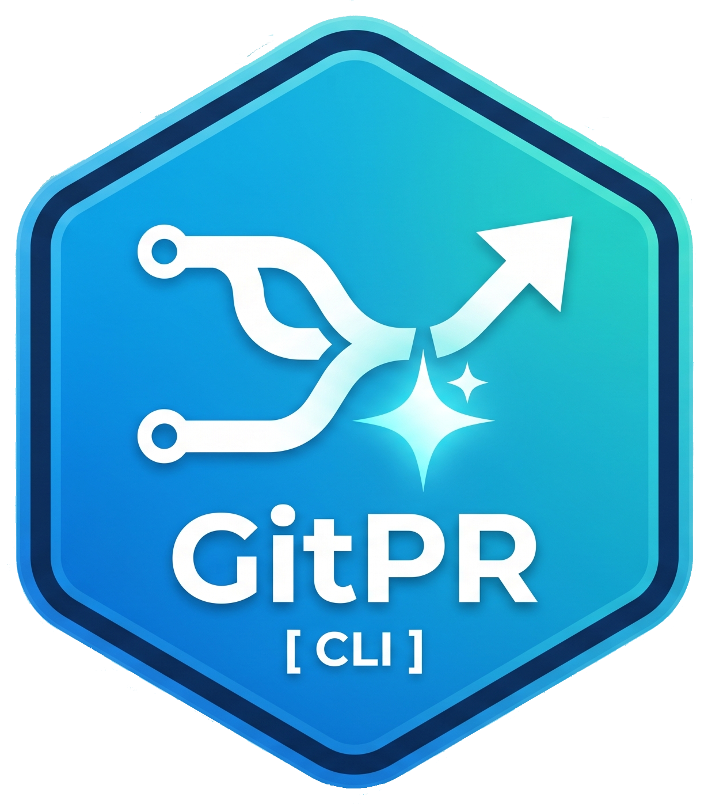

# **GitPR CLI 🚀** — Português (Brasil)

<p align="center">
  
</p>

O GitPR CLI é uma ferramenta de automação via linha de comando que usa inteligência artificial do **Google Gemini** e **DeepSeek** para analisar suas alterações de código (git diff) ou arquivos inteiros. A ferramenta gera automaticamente mensagens de commit no padrão *Conventional Commits*, descrições detalhadas de Pull Request e revisões profundas de código com foco em reduzir dívida técnica.

## **🛠️ Tecnologias e Bibliotecas Utilizadas**

Este projeto foi desenvolvido em Python e utiliza as seguintes bibliotecas principais:

* [**Click**](https://click.palletsprojects.com/): Para criar uma interface de linha de comando (CLI) robusta e amigável.
* [**Google GenAI**](https://pypi.org/project/google-genai/): SDK oficial para integração direta com a API do Gemini.
* [**OpenAI**](https://pypi.org/project/openai/): Biblioteca utilizada devido à sua total compatibilidade com a poderosa API da **DeepSeek**.
* [**Python-dotenv**](https://pypi.org/project/python-dotenv/): Para o gerenciamento seguro de variáveis de ambiente.
* [**Pytest**](https://docs.pytest.org/): Para executar testes unitários de forma simples, colorida e legível no console.
* [**Cryptography**](https://cryptography.io/): Para garantir que sua `GEMINI_API_KEY` seja armazenada de forma encriptada e segura em disco.
* [**PyYAML**](https://pyyaml.org/): Usado para ler e processar as regras personalizadas de análise estática do arquivo `.gitpr.linter.yml`.
* [**Textual**](https://textual.textualize.io/): Biblioteca poderosa para criação de Interfaces Gráficas de Terminal (TUI), usada no painel interativo de geração e edição de issues.
* [**Requests**](https://pypi.org/project/requests/): Biblioteca elegante e robusta para requisições HTTP, usada para comunicação com a API REST do GitHub.

----

## 📦 Como Compilar o Executável Localmente

Se você deseja gerar seu próprio binário a partir do código fonte, utilizamos o **PyInstaller**. Certifique-se de estar no diretório raiz do projeto com o ambiente virtual configurado.

1. Instale as dependências de desenvolvimento (se ainda não o fez):
   ```bash
   pipenv install --dev
   ```

2. Execute o comando de build apontando para nosso ponto de entrada (`run.py`):
   ```bash
   pipenv run pyinstaller --noconfirm --onefile --icon=icon.ico --name gitpr run.py
   ```
> **Nota técnica:** A flag `--onefile` garante que todo o Python, bibliotecas e dependências sejam comprimidos em um único binário. 🛠️

Após executar este comando, o PyInstaller criará algumas pastas (`build` e `dist`).
Seu arquivo final pronto para uso estará dentro da pasta **`dist/`** com o nome `gitpr` (ou `gitpr.exe` no Windows).


----

## 🧪 Executando Testes

Para garantir que a lógica de captura do Git e a integração com a IA estão funcionando corretamente, utilizamos testes unitários.

1. Instale as dependências de teste (se ainda não o fez):
   ```bash
   pipenv install --dev pytest
   ```

2. Execute os testes com o comando:
   ```bash
   pipenv run pytest -v
   ```
O Pytest detectará automaticamente os arquivos dentro da pasta `tests/` e exibirá um relatório detalhado da execução.

----
## **⚙️ Instalação e Configuração**

### **Usando o Executável (Recomendado)**

1. Baixe o executável do GitPR na aba "Releases" do GitHub.
2. Mova o executável para uma pasta que esteja no seu PATH (ex.: /usr/local/bin no Linux/Mac ou sua pasta de usuário no Windows).
3. Na primeira execução, o assistente irá guiá-lo:
   ```bash
   $ gitpr
   ```
```bash
🚀 Intelligent PR Automation with AI

🔧 First run detected! Let's configure GitPR CLI.

🔑 Enter your GEMINI_API_KEY:

📄 Default output filename pattern [{branch}_{datetime}_PR_DESC.md]:
```
*Nota: Sua configuração será salva com segurança no arquivo `~/.gitpr/.env`.*

> **🔒 Nota de Segurança:** O GitPR CLI usa criptografia simétrica (Fernet). Sua chave de API é armazenada como um hash no arquivo `.env`, e a chave mestra para descriptografia é gerada automaticamente em `~/.gitpr/secret.key`. **Nunca compartilhe seu arquivo secret.key.**

### A Partir do Código Fonte

1. Clone o repositório: `git clone https://github.com/natanfiuza/gitpr.git`

2. Entre na pasta: `cd gitpr`

3. Configure o ambiente:
```bash
pipenv install google-genai openai python-dotenv click cryptography
```
4. Execute: pipenv run python src/main.py

## **💻 Como Usar**

O GitPR possui um comportamento padrão poderoso e várias opções avançadas para auxiliá-lo no seu dia a dia como desenvolvedor.

### **Comportamento Padrão (Pull Request)**
Simplesmente execute o comando puro no seu terminal:
```bash
gitpr
```
A ferramenta irá sincronizar com o remoto (`git fetch`), comparar suas alterações com a branch principal remota (ex.: `origin/main`) e gerar um arquivo Markdown (ex.: `feature-login_20260421110134_PR_DESC.md`) na raiz do seu projeto com a sugestão completa para o seu Pull Request.

### **Opções e Comandos Avançados**
Você pode passar as seguintes *flags* para ações específicas:

* `-c` ou `--commit`: Executa um `git diff` local e exibe **apenas a mensagem de commit sugerida**.
* `-r` ou `--review`: Realiza um **Code Review** detalhado das alterações locais.
* `-f` ou `--fullreview`: Realiza um **Code Review Completo** analisando todas as alterações desde a branch remota.
* `-i <arquivo>` ou `--input <arquivo>`: **Auditoria Completa de Arquivo.** Deve ser usado junto com `-r` ou `-f`; ignora o histórico git e faz um Code Review do arquivo inteiro. Excelente para atuar como consultor em refatoração de código legado.
* `--provider <gemini|deepseek|ollama>`: Força o uso de uma IA específica apenas para esta execução, ignorando o padrão salvo no `.env`.
* `--lang <codigo>`: Força o idioma da interface para esta execução (ex.: `en_us`, `pt_br`). Sobrescreve o `GITPR_LANG` do `.env` sem persistir a alteração.
* `-ch` ou `--chat`: Abre o **Chat Interativo de Pair Programming** — um terminal TUI onde a IA enxerga seu diff atual e mantém uma conversa contextual. Possui memória por branch, comandos slash (`/explain`, `/tests`, `/optimize`, `/clear`), auto-patching (F5), atualização de diff (F2) e exportação de sessão (F6).
* `-l` ou `--linter`: Executa **apenas o linter estático local** (sem chamadas de IA). Ideal para uso em pipelines de CI/CD para bloquear código fora de conformidade.
* `-ih` ou `--installhooks`: Instala automaticamente **Git Hooks locais** (`pre-commit` e `prepare-commit-msg`) no seu repositório.
* `-s` ou `--skill`: Cria os arquivos de template de contexto da IA (`.gitpr.commit.md`, `.gitpr.pr.md`, `.gitpr.review.md`, `.gitpr.filereview.md`, `.gitpr.issue.md`, `.gitpr.blame.md`) e o Linter (`.gitpr.linter.yml`) na raiz do projeto.
* `-is` ou `--issue`: Gera automaticamente um rascunho de uma **Issue padronizada** e abre uma interface interativa (TUI) para edição ou envio direto via API REST. Esta funcionalidade possui **3 motores de contexto** dependendo da combinação de comandos:
  * **Issue de Código Novo (`gitpr -is`):** Lê o `git diff` atual. **Por que usar:** Ideal para documentar rapidamente a tarefa que você acabou de programar, antes de commitar.
  * **Issue de Épico/Release (`gitpr -is -ht`):** Lê o histórico completo da branch atual (Git Log + Cache de PR). **Por que usar:** Ideal para gerar documentação consolidada de uma release inteira ou de uma *feature* grande que levou vários dias/commits para ser concluída.
  * **Issue de Dívida Técnica/Arqueológica (`gitpr -is -b arquivo:linhas`):** Lê a linha do tempo de uma regra de negócio específica. **Por que usar:** Ideal para documentar dívida técnica, explicando como um bloco de código legado evoluiu e por que ele precisa ser refatorado.
* `-h` ou `--help`: Mostra a ajuda geral com todas as opções. Use junto com outra flag para **ajuda contextual** (ex.: `gitpr -h --issue`, `gitpr -h --linter`) com um link direto para a documentação detalhada de cada funcionalidade.
* `-u` ou `--update`: Verifica e instala a versão mais recente do GitPR (Auto-Updater).

> **⚙️ Technical Note (--hook):** GitPR has a hidden flag `--hook <file>` that is triggered exclusively by the Git Hooks system in the background. It allows the AI to inject the suggested message directly into Git's temporary file, without cluttering your terminal.
>
> **⚙️ Nota Técnica (--pre-save):** O GitPR possui uma flag oculta de debug `--pre-save` que pode ser combinada com qualquer comando de IA (ex.: `gitpr -c --pre-save`). Antes de cada chamada à IA, ela salva o payload completo que será enviado ao modelo (system instruction + prompt + contadores de caracteres) em um arquivo `_{acao}-{datahora}.json` na pasta atual, e depois prossegue normalmente. Útil para inspecionar prompts muito grandes. Obs.: quando a resposta vem do cache local, nenhuma chamada é feita e nenhum arquivo é gerado.

### 📦 Diffs Gigantes (Map-Reduce)

Quando o diff é grande demais para uma única chamada de IA (acima de ~90 mil tokens estimados), o GitPR o divide automaticamente em lotes por arquivo, pede à IA um resumo técnico de cada parte (Map) e unifica tudo na mensagem de commit, review ou descrição de PR final (Reduce). Sem flags — ativa sob demanda e mostra o progresso no console.

📚 Documentação completa: [docs/map-reduce-diff.pt_br.md](docs/map-reduce-diff.pt_br.md)

## 🛡️ Linter Local (Análise Estática)

O GitPR CLI permite que você defina regras rigorosas que serão validadas instantaneamente durante o `--review` ou `--fullreview`, sem depender de IA. Isso é ideal para impedir que erros comuns (como `console.log` ou IPs de teste) cheguem ao repositório.

### Como configurar o `.gitpr.linter.yml`:
Ao executar `gitpr --skill`, um template será gerado. Você pode configurar regras usando Expressões Regulares (Regex):

```yaml
rules:
  - name: "check-localhost"
    extensions: ["js", "php"] # Extensões a serem validadas
    regex: 'http(s)?://(localhost|127\.0\.0\.1)' # O que procurar
    message: "🚨 Localhost usage detected in file {file_name}"
    ignore_comments: true # Ignora se a linha estiver comentada
    ignore_paths: # Pastas ou arquivos ignorados (aceita *)
      - "vendor/*"
      - "node_modules/*"
```

O Linter analisa apenas as **linhas adicionadas** no seu `git diff`, garantindo uma execução focada e extremamente rápida. Se houver violações, elas aparecerão destacadas no topo do seu arquivo de review.

## 🧠 Arquitetura Multi-Modelo (IA Agnóstica)

O GitPR não está preso a uma única Inteligência Artificial. Durante a configuração inicial, o usuário pode escolher seu motor padrão. Atualmente oferecemos suporte a:
* **Google Gemini** (Padrão: `gemini-2.5-flash`)
* **DeepSeek** (Padrão: `deepseek-chat`)
* **Ollama** (Local) — execute modelos localmente sem internet, totalmente compatível com o formato da API OpenAI

Você pode alternar dinamicamente os modelos configurando as variáveis `GEMINI_API_MODEL` ou `DEEPSEEK_API_MODEL` no seu arquivo `~/.gitpr/.env`, ou alternar em tempo real usando a flag `--provider`.

## 🎯 Sistema de "Skills" Customizáveis (Prompt Engineering)

Em vez de esconder instruções de IA no código fonte, o GitPR usa arquivos Markdown locais que atuam como *System Instructions*. Ao executar `gitpr -s`, os seguintes arquivos são gerados na raiz do seu projeto para personalizar a "persona" da IA de acordo com as regras de negócio da sua empresa:

* `.gitpr.commit.md`: Regras para gerar mensagens de commit curtas.
* `.gitpr.pr.md`: Estrutura de tópicos obrigatória para a descrição do Pull Request.
* `.gitpr.review.md`: Define o foco arquitetural (ex.: SOLID, Clean Code) para análise do diff.
* `.gitpr.filereview.md`: Define regras rigorosas de coesão e acoplamento para auditoria completa de arquivo (usado com `--input`).
* `.gitpr.issue.md`: Define a estrutura e o nível de detalhe necessários para gerar Issues padronizadas (usado com `--issue`).
* `.gitpr.blame.md`: Define o foco da análise arqueológica para rastreamento de código legado (usado com `--blame`).

## 🌐 Internacionalização (i18n)

O GitPR detecta automaticamente o idioma do seu sistema e exibe as mensagens no seu idioma nativo. O sistema i18n é inspirado no **helper `__()` do Laravel**:

* **Detecção automática:** Na primeira execução, o GitPR detecta o idioma do SO e salva em `~/.gitpr/.env` (`GITPR_LANG`).
* **Arquivos de tradução:** Os pacotes de idioma são baixados automaticamente do repositório oficial para `~/.gitpr/langs/`.
* **Fallback em inglês:** Se uma tradução estiver faltando, o texto em inglês é exibido diretamente.
* **API do desenvolvedor:** Use `from src.i18n import __` e envolva todas as strings de interface com `__("Seu texto aqui")`.
* **Placeholders:** Suporta parâmetros nomeados — `__("Baixando {file}...", file="template.md")`.

Para forçar um idioma específico, defina `GITPR_LANG=pt_br` ou `GITPR_LANG=en` no `~/.gitpr/.env`.

> 📖 **Guia completo do desenvolvedor:** [docs/i18n_explanation.pt_br.md](docs/i18n_explanation.pt_br.md) — arquitetura, padrões de uso, precauções com import circular e como adicionar novos idiomas.

## 📚 Documentação Técnica e Guias Avançados

Para manter este README conciso, detalhamos as implementações mais avançadas focadas em **DevOps** e **Integração Contínua** em documentos separados.

Se você deseja implementar o GitPR como uma barreira de qualidade automatizada em sua equipe, confira os guias abaixo.

> 🌐 Cada guia está disponível em **5 idiomas** — adicione `.pt_br`, `.pt_pt`, `.fr_fr` ou `.es_es` antes da extensão `.md` para versões traduzidas (ex.: `docs/understanding_chat_functionality.pt_br.md`). Inglês é o padrão sem sufixo.

### Chat e Recursos Interativos

* [**🧠 Chat Interativo (Pair Programming)**](https://github.com/natanfiuza/gitpr/blob/main/docs/understanding_chat_functionality.md) — Como usar o chat com IA com memória, comandos slash, auto-patch e exportação de sessão.

### DevOps & CI/CD

* [**Git Hooks Locais (Shift-Left)**](https://github.com/natanfiuza/gitpr/blob/main/docs/git-hooks-locais.md) — Como usar `gitpr --installhooks` para criar barreiras de qualidade na máquina do desenvolvedor e usar IA para gerar mensagens de commit automaticamente.
* [**Linter Estático Customizável**](https://github.com/natanfiuza/gitpr/blob/main/docs/linter-regras-customizadas.md) — Como criar regras de validação no `.gitpr.linter.yml` para CI/CD e hooks de pre-commit.
* [**Integração CI/CD (GitHub Actions)**](https://github.com/natanfiuza/gitpr/blob/main/docs/github-ci-linter.md) — Como executar o GitPR no pipeline para bloquear "Merge" de PRs com violações.

### Funcionalidades Principais

* [**Pull Request (Modo Padrão)**](https://github.com/natanfiuza/gitpr/blob/main/docs/pr-descricao-padrao.md) — Fluxo completo para gerar descrições de PR sem flags.
* [**Code Review com IA**](https://github.com/natanfiuza/gitpr/blob/main/docs/code-review-ia.md) — Guia dos modos de review (`--review`, `--fullreview`) e auditoria de arquivos (`--input`).
* [**Mensagens de Commit com IA**](https://github.com/natanfiuza/gitpr/blob/main/docs/commit-message-ia.md) — Como gerar mensagens no padrão Conventional Commits e integrar com Git Hooks.
* [**Geração de Issues e Interface TUI**](https://github.com/natanfiuza/gitpr/blob/main/docs/issue-tui-help.md) — Como usar a interface gráfica de terminal (TUI) e os 3 motores de contexto para gerenciar Issues estruturadas.
* [**Arqueólogo de Código (Git Blame)**](https://github.com/natanfiuza/gitpr/blob/main/docs/blame-arqueologo.md) — Como rastrear a origem de regras de negócio com `git blame` e IA.
* [**Sistema de Skills e Templates**](https://github.com/natanfiuza/gitpr/blob/main/docs/skill-template.md) — Como personalizar o comportamento da IA com arquivos `.gitpr.*.md`.

### Configuração e Infraestrutura

* [**Provedores de IA**](https://github.com/natanfiuza/gitpr/blob/main/docs/providers-ia.md) — Configuração e seleção entre Google Gemini, DeepSeek e Ollama.
* [**Auto-Updater**](https://github.com/natanfiuza/gitpr/blob/main/docs/auto-update.md) — Como funciona a atualização automática (hot-swap) do GitPR.
* [**Token GitHub (PAT) — Integração e Segurança**](https://github.com/natanfiuza/gitpr/blob/main/docs/github-pat-integration.md) — Entenda como o GitPR cria issues diretamente no repositório com autenticação.
* [**Internacionalização (i18n)**](https://github.com/natanfiuza/gitpr/blob/main/docs/i18n_explanation.md) — Arquitetura, padrões de uso e como adicionar novos idiomas.

## ⚡ Sistema de Cache Local (Economia de Cota)

O GitPR possui um motor de cache inteligente baseado em **MD5**. Sempre que você executa um comando (`--review`, `--commit`, etc.), a ferramenta gera um hash exato do seu código atual (diff) e das instruções.
Se você executar o mesmo comando novamente sem alterar o código, o GitPR intercepta a requisição e retorna o resultado instantaneamente (em milissegundos) da pasta `~/.gitpr/cache/prompts/`, economizando seu tempo e suas cotas da API!

## 🔄 Auto-Updater (Atualização Over-The-Air)

Nunca mais se preocupe em baixar novas versões manualmente. O GitPR possui um Guardião de Conexão e um atualizador integrado:
* Verifica a disponibilidade de rede antes de iniciar para não bloquear seu fluxo de trabalho offline.
* A cada execução, verifica silenciosamente se há uma nova release oficial na API do GitHub.
* Você pode forçar a verificação e instalação executando `gitpr --update` ou `gitpr -u`.
* A ferramenta usa a técnica de *Hot-Swap*, baixando o novo `.exe` e substituindo a versão antiga de forma transparente.

## Publicação no PyPI

```bash
pipenv run python -m build
pipenv run twine upload dist/*
```
## **🤝 Como Contribuir**

Contribuições são muito bem-vindas! Para contribuir:

1. Faça um fork do projeto.
2. Crie uma branch para sua *feature* (git checkout -b feature/NovaFuncionalidade).
3. Faça commit das suas alterações (git commit -m 'feat: adiciona nova funcionalidade'). Dica: Use o próprio GitPR para gerar esta mensagem! 😄
4. Faça push para a branch (git push origin feature/NovaFuncionalidade).
5. Abra um Pull Request.

## **✨ Agradecimentos e Autoria**

Projeto idealizado e desenvolvido por:

**Natan Fiuza** - [contato@natanfiuza.dev.br](mailto:contato@natanfiuza.dev.br)

## **📄 Licença**

Este projeto está licenciado sob a **GNU Lesser General Public License v2.1 (LGPL-2.1)**. Veja o arquivo LICENSE para mais detalhes.
